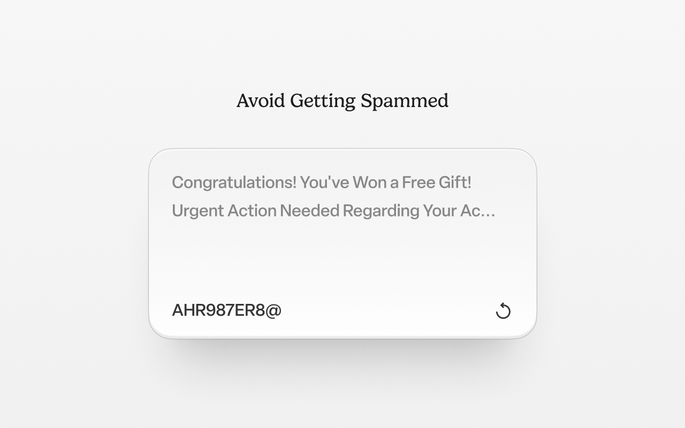

## A Browser Tool for Avoid Getting Spammed

Raccoon is a browser tool that helps you protect your online privacy by generating temporary email addresses you can use instead of your real one. Protecting you from spam, phishing, and unwanted marketing emails. Powered by <a href="https://api.mail.tm">Mail.tm</a>.

 

**Features:**

* Instant disposable email generation with a single click.
* Easy access and readability of your temp mail inbox.

 

**Installation:**

For chromium-based browsers, you can download the extension here:
- <a href="https://chromewebstore.google.com/detail/raccoon-temporary-disposa/ccdeeemajicjhdldloahdddilalegklp">Chrome Web Store</a>

For Firefox-based browsers, use branch `firefox-0.02.1`. (Coming soon to [Firefox's Add-ons store](https://addons.mozilla.org/en-US/firefox/))

